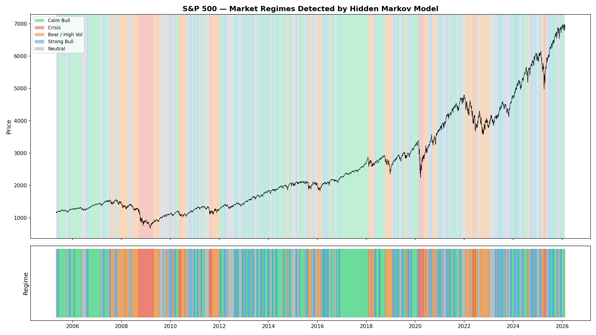
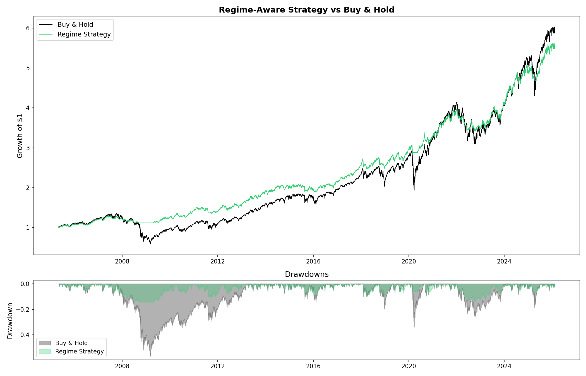

# Market Regime Detection using Hidden Markov Models

Unsupervised machine learning system that identifies hidden market regimes (bull, bear, crisis, neutral) from S&P 500 data and uses them to build a risk-aware trading strategy.



## Key Results

| Metric | Buy & Hold | Regime Strategy |
|--------|-----------|-----------------|
| Annual Return | 8.6% | 8.2% |
| Annual Volatility | 19.2% | **9.5%** |
| Sharpe Ratio | 0.44 | **0.86** |
| Max Drawdown | -56.8% | **-14.3%** |

The regime-aware strategy delivers nearly identical returns with **half the volatility** and a **75% reduction in max drawdown**.



## How It Works

1. **Data Pipeline** — Download 20 years of S&P 500 daily data via Yahoo Finance
2. **Feature Engineering** — Compute log returns, rolling volatility (5/21/63 day), volatility ratio, RSI, and moving average distance
3. **Regime Detection** — Fit a Gaussian Hidden Markov Model with Baum-Welch (EM) algorithm, select optimal states via BIC
4. **Strategy** — Adjust market exposure based on detected regime (100% in bull, 0% in crisis)

## Detected Regimes

| Regime | Days | Annualized Return | Volatility | RSI |
|--------|------|-------------------|------------|-----|
| Strong Bull | 1,022 (19.5%) | +34.4% | 12.1% | 68.2 |
| Calm Bull | 1,634 (31.2%) | +12.5% | 8.1% | 60.7 |
| Neutral | 1,325 (25.3%) | +7.7% | 15.3% | 50.5 |
| Bear / High Vol | 972 (18.6%) | -7.1% | 23.7% | 45.7 |
| Crisis | 277 (5.3%) | -51.5% | 51.1% | 44.5 |

## Tech Stack

- **Python** — pandas, NumPy, matplotlib
- **hmmlearn** — Gaussian HMM implementation
- **scikit-learn** — Feature scaling
- **yfinance** — Market data

## Project Structure
```
├── src/
│   ├── data_loader.py      # S&P 500 data download
│   ├── explore.py           # Data exploration
│   ├── returns.py           # Log return computation
│   ├── volatility.py        # Rolling volatility features
│   ├── features.py          # Feature matrix construction
│   ├── hmm_model.py         # HMM training and regime detection
│   ├── plot_regimes.py      # Regime visualization
│   ├── backtest.py          # Strategy backtesting
│   └── summary.py           # Project summary report
├── models/                   # Trained HMM and scaler
├── results/                  # Charts and analysis
├── data/                     # Raw and processed datasets
└── requirements.txt
```

## Quick Start
```bash
git clone https://github.com/YOUR_USERNAME/market-regime-detection.git
cd market-regime-detection
python -m venv venv
source venv/bin/activate
pip install -r requirements.txt

# Run the full pipeline
python src/data_loader.py
python src/returns.py
python src/volatility.py
python src/features.py
python src/hmm_model.py
python src/plot_regimes.py
python src/backtest.py
python src/summary.py
```

## Concepts Demonstrated

- Hidden Markov Models and the Baum-Welch (EM) algorithm
- Viterbi decoding for optimal state sequences
- Model selection using Bayesian Information Criterion (BIC)
- Financial feature engineering (log returns, rolling volatility, RSI)
- Backtesting with look-ahead bias prevention
- Risk-adjusted performance measurement (Sharpe ratio, max drawdown)

## Author

**Vignesh Pai**

## License

MIT